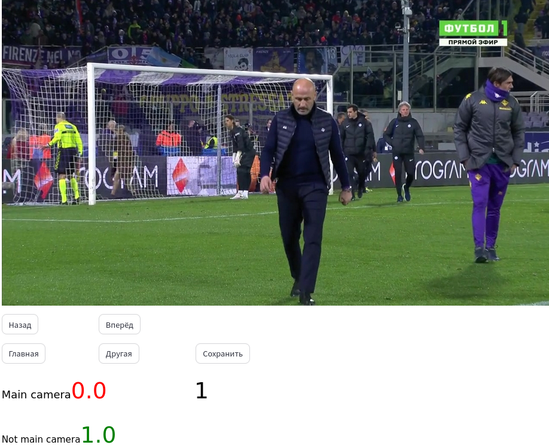
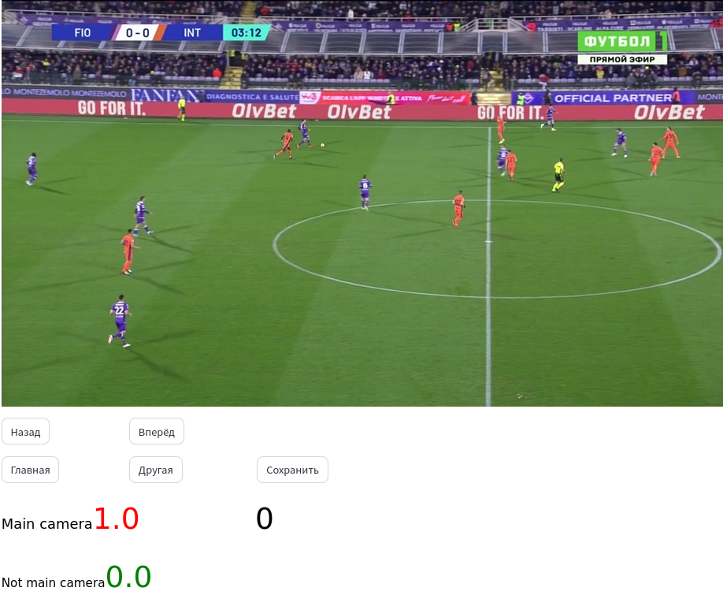

# Models for sport broadcast

Repository with models for processing broadcast video of sports events

###  Models

1. Resnet-18 for broadcast classification from main camera
```python
import torch
import torch.nn as nn
from torchvision import models

model = models.resnet18()
num_ftrs = model.fc.in_features

model.fc = nn.Linear(num_ftrs, 2)
model.load_state_dict(torch.load('PATH to file main_camera_extractor.pt'))
model.eval()
```
**Example**



